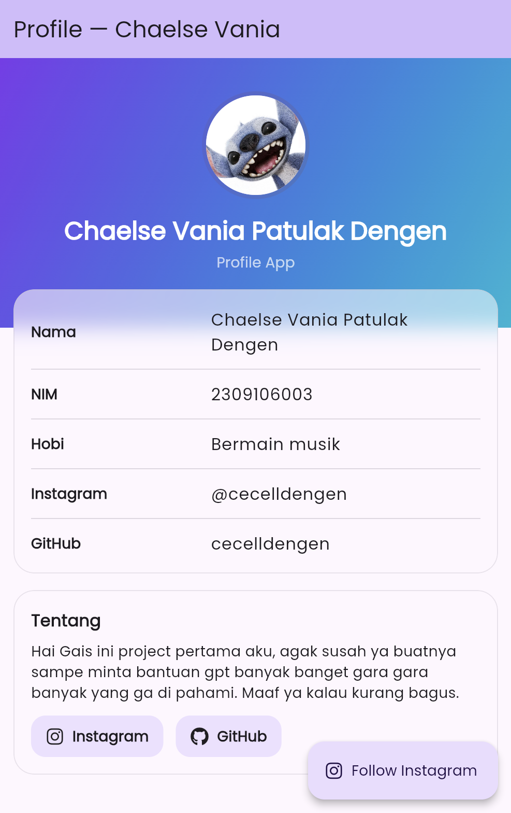

# 📱 Flutter Profile App — Chaelse Vania Patulak Dengen

Aplikasi Flutter sederhana untuk menampilkan **profile card** dengan desain modern menggunakan:
- 🎨 Gradient header
- 🔲 Glassmorphism card
- 🔗 Tombol sosial (Instagram & GitHub)
- 👤 Foto profil (avatar)

---

## ✨ Fitur Utama
- Menampilkan informasi profil:
  - **Nama**: Chaelse Vania Patulak Dengen  
  - **NIM**: 2309106003  
  - **Hobi**: Bermain musik  
  - **Instagram**: [@chaelsedengen](https://instagram.com/chaelsedengen)  
  - **GitHub**: [cecel](https://github.com/cecel)  
- Avatar berbasis **foto** (misalnya `assets/images/stitch.jpg`)
- UI modern dengan **Google Fonts** & **Font Awesome Icons**
- Tombol interaktif membuka link sosial via `url_launcher`

---

## 🛠️ Teknologi & Package
Project ini dibuat dengan:
- [Flutter](https://flutter.dev/) 3.x
- [google_fonts](https://pub.dev/packages/google_fonts) → untuk custom font
- [font_awesome_flutter](https://pub.dev/packages/font_awesome_flutter) → untuk icon sosial
- [url_launcher](https://pub.dev/packages/url_launcher) → untuk membuka link eksternal

---
## 📸 Preview

